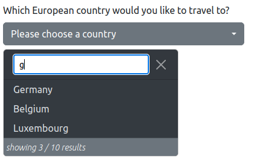

# jquery-selectSuggest

Create a Bootstrap dropdown for server suggestion.

### Table of contents
- [jquery-selectSuggest](#jquery-selectsuggest)
    + [Requirements](#requirements)
    + [Installation](#installation)
    + [Usage](#usage)
        * [html](#html)
        * [javascript](#javascript)
    + [Options](#options)
    + [Methods](#methods)
    + [Events](#events)
    + [Required response for suggestion](#required-response-for-suggestion)
    + [backend example](#backend-example)


> This plugin was developed for single selection only for now.
### Requirements
- Boostrap >= 5.0
- jQuery 3.6 -> I can't name the minimum jQuery version, I developed it on jQuery 3.6.
### Installation
Simply include the following script at the end of the body tag.
```html
<script src="jquery.bsSelectSuggest.js"></script>
```
No further CSS needed, the current bootstrap classes are used.

### Usage
##### html
Place the hidden input field where you want the dropdown to appear.
```html
<input type="hidden"
       id="exampleInput"
       data-bs-toggle="suggest"
       data-bs-target="path/to/actions.php"
>
```
##### javascript
```js
$('#exampleInput').each(function(i, input){
    $(input).suggest(options||{});
});
```
> Please make a separate call for each suggestion box!
### Options
The following options are currently implemented.
```js
{
    "limit": 10, // the maximum number of records
    "typingInterval": 400, // The milliseconds to wait until a request starts
    "darkMenu": false, // show the dropdown in dark style
    "btnWidth": 'fit-content', // Corresponds to the CSS property width
    "btnClass": "btn btn-outline-secondary", // dropdown button class
    "emptyText": "Please choose..", // placeholder for no selection
    "waitingForTypingText": "Waiting for typing", // Status
    "typingText": "typing..", // Status
    "loadingText": "Loading.." // Status
}
```
### Methods
Currently, there is only one method.
```js
$('selector').suggest('val', value);
```
### Events
```js
$('selector')
    .on('suggest-change', function(e, id, text){
        console.log(id, text, 'was selected');
    })
    .on('suggest-error', function(e, message){
        console.log('error', message);
    })
```
### Required response for suggestion
The parameters `q` and `limit` are sent to the server via `GET`.
`q` is in this case the search string and `limit` the maximum number of records to be determined.
As response the plugin expects an `array` with `items` and the `total` number of records.  
An item consists of the attributes `id` and `text`.
```json
{
    "items": [{
        "id": 1,
        "text": "Germany"
      },{
        "id": 2,
        "text": "Spain"
      },{
        "id": 3,
        "text": "Italy"
      }
    ],
    "total": 75
}
```
When the method `val` is called, only the parameter `value` is sent to the server   
and only **one item object** is expected (no array).
```js
// call method val
$('selector').suggest('val', value);

// response
{
    "id": 1,
    "text": "Germany"
}
```

### backend example
A complete example can be found in the demo folder.
```php
<?php
/**
 * Note: PHP8.0 or higher is required for this script.
 */
header('Content-Type: application/json');

try {
    // Fetch a test data set
    /** @var stdClass[] $countries */
    $countries = json_decode(file_get_contents('countries.json'), false, 512, JSON_THROW_ON_ERROR);

    // Try to find the query parameter value
    $value = filter_input(INPUT_GET, 'value', FILTER_VALIDATE_INT);

    /** @var null|stdClass|array $return */
    $return = null;

    // Was the value parameter found?
    $fetchSingleData = ! empty($value);

    // if yes
    if ($fetchSingleData)
    {
        // Get the record using the value parameter
        $data = array_values(array_filter($countries, static function($country) use ($value){
            return $country->id === $value;
        }));
        $return = $data[0];
    }
    // if no
    else
    {
        // Get parameter q and limit
        $limit = filter_input(INPUT_GET, 'limit', FILTER_VALIDATE_INT);
        $q = filter_input(INPUT_GET, 'q');
        $search = empty($q)? false : strtolower($q);

        // If q was not passed or is empty, do not return any results either.
        // Otherwise, search for matches of the search string.
        $data = array_slice(
            array:array_values(array_filter($countries, static function($country) use ($search){
                return $search === false || str_contains(strtolower($country->text), $search);
            })),
            offset: 0,
            length: $limit
        );

        // Put the result in the response
        $return['items'] = $data;
        $return['total'] = count($countries);
    }
    // Return as JSON
    http_response_code(200);
    exit(json_encode($return, JSON_THROW_ON_ERROR));
} catch (JsonException $e) {
    http_response_code(500);
    /** @noinspection PhpUnhandledExceptionInspection */
    exit(json_encode(['error' => $e->getMessage()], JSON_THROW_ON_ERROR));
}


```